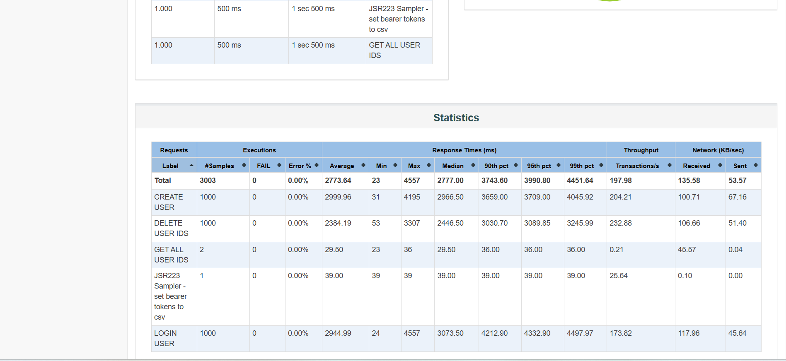
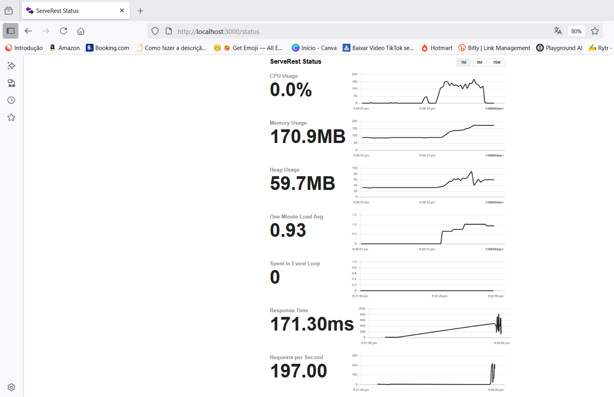

# JMeter API Test Plan for ServeRestApp

Sample project to experiment with [Jmeter](https://jmeter.apache.org/) to test the ServeRest app in localhost using Docker Image.

[](https://github.com/ServeRest/ServeRest/)


## 📋 Test Plan Overview

The idea is to hit /login endpoint (the steps below were designed to do so)

- **GET ALL USERS /usuarios AND set it to a CSV file**: Fetches all users and save it to a CSV file.
  - **JSR223 PostProcessor - set userId, userEmail and userPassword to csv**: Extracts user IDs, emails, and passwords.
  - **HTTP Header Manager**: Managers headers content-type
- **DELETE USER ID /usuarios/${user_id}**: The idea is to delete all users present on database before creation of it
  - **CSV DataSet Config - read user_id.csv and fetch userId**: It's gonna read the csv file created before to fetch mainly userId
  - **HTTP Header Manager**: Managers headers content-type
- **POST CREATE USER /usuarios**: Create user
  - **HTTP Header Manager**: Managers headers content-type
- **GET ALL USERS /usuarios AND set it to a CSV file**: Fetches all users again and save it to a CSV file.
  - **JSR223 PostProcessor - set userId, userEmail and userPassword to csv**: Extracts user IDs, emails, and passwords.
  - **HTTP Header Manager**: Managers headers content-type
- **POST LOGIN USERS /login AND set it to a CSV file**: Perform login action by all users
  - **CSV DataSet Config - read user_id.csv and fetch email and password's user**: Extracts user email and passwords.
  - **JSR223 PostProcessor - save on memory's variables all the bearer tokenssave on memory's variables all the bearer tokens**
  - **HTTP Header Manager**: Managers headers content-type
- **SET BEARER TOKENS TO CSV**: Export all bearer tokens to a new CSV file
  - **JSR223 Sampler - set bearer tokens to csv**: Export all bearer tokens to a new CSV file

## 🧪 How to Use

1. Open the `.jmx` file using Apache JMeter.
2. Update the number of **Threads** in the following Thread Groups:  
   - `DELETE USERS`  
   - `CREATE USERS`  
   - `LOGIN USERS`  
   (The default is set to **1000**)
3. Adjust the file path in the following Thread Groups:  
   - `DELETE USERS`  
   - `LOGIN USERS`  
   - `SET BEARER TOKENS TO CSV`  
   
   The current path is: C:/Users/clark/OneDrive/Documentos/projetos/apache-jmeter-5.6.3/apache-jmeter-5.6.3/bin/user_ids.csv
   
    Make sure to update it according to your local environment.
5. Review results in the **View Results Tree** listener or **Aggregate Reports**. (It's gonna generate a report.csv)
6. **To generate the HTML report (on Windows) Example:**

   - Open the Command Prompt (`cmd`)
   - Navigate to your JMeter `bin` directory:
     ```bash
     cd C:\Users\clark\OneDrive\Documentos\projetos\apache-jmeter-5.6.3\apache-jmeter-5.6.3\bin
     ```
   - Run the following command:
     ```bash
     jmeter -g "C:\Users\clark\OneDrive\Documentos\projetos\apache-jmeter-5.6.3\report.csv" -o "C:\Users\clark\OneDrive\Documentos\projetos\apache-jmeter-5.6.3\report\report.html"
     ```
---

## 📈 Results

Tests were executed locally via Docker on a Windows 10 machine with the following specs:

- **RAM**: 8GB  
- **CPU**: Intel(R) Core(TM) i5-10210U @ 1.60GHz  
- **JMeter**: 5.6.3

Result: The system handled **1000 concurrent threads** on all endpoints with a ramp-up of 1 second. Beyond this, performance started degrading due to CPU overutilization.

| Report Preview            | Performance Stats            |
|---------------------------|------------------------------|
|  |  |

As you can see during execution of 1000 threads with ram=-up of 1s, the CPU usage got it spike to 150%.

---

## ⚙️ Requirements

- Apache JMeter 5.6.3 or compatible.
- Java 8++

## 📄 License

MIT License
